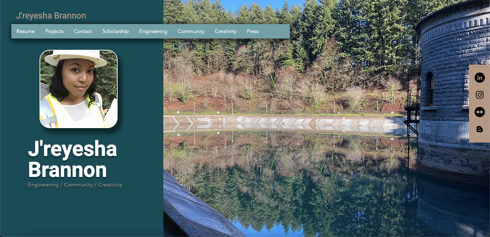
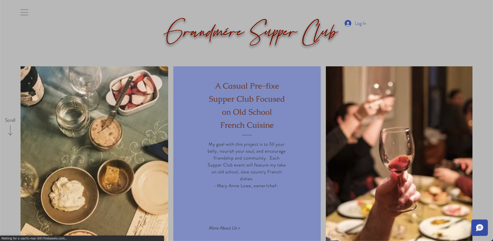

# Welcome! I'm Danielle.

## **Find _all_ my important links on my !**

<!--  -->

 

### 📙 Overview

I am a Ruby/Rails based Software Engineer at a non-profit in curriculum publishing, [Open Up Resources](https://www.openupresources.org/), where I have been for 3 years and counting. Before taking my current developer role, I completed a Software Development internship at the [NSBE Pro-PDX](https://www.nsbepropdx.org/), was a contract junior developer for [GiftRibbn](https://www.ribbn.io/), and graduated from a 6-month, full-time certificate program in Web & Mobile Development at [Epicodus](www.epicodus.com) Code School in Portland, OR. 

Since getting into tech, I have written several blogs, been on a guest several podcasts and tech Twitch streams, started & maintained a Wiki of resources for folks getting into tech (find that link in my LinkTree above), volunteered at RubyConf 2022, and served on RailsConf 2023 Program Committee. I continue to look for ways to engage in the Ruby/Rails and broader technical community while joyfully getting to do what I love for work - perpetual learning.

 

- Pronouns: **she/her, they/them**
- 📙 Check out my [Wiki](https://youneedawiki.com/app/page/1NIm8iRFF1MEU68GZkar-7ZKhIzTv8MwTKuxeft92kFI?p=1j6vUn9RcB_NTcr1iP0Dc9sLN53Xf_Ah8) where I keep a running list of resources for folks getting into tech.
- 🌱 I’m currently deep diving into ... ⚡ Ruby/Rails #forever ❤️ ⚡
- ❓ Ask me about ... getting into tech from non-traditional backgrounds and craft cocktails! 🍹
- 👣 Next steps for me ... continued community engagement and tech talks! 🦾

 

### 💻 Current Tech Stack

### 💻 Previously Used Tech

<!-- 
 -->

 

## 📊 Work

### Most Recently

- Lead Engineer for [Skills Block 2024](https://access.openupresources.org/curricula/el-skills-block-2024) curriculum
  - Entirely responsible for the modeling and importing of the complete complex Skills Block curriculum
  - Transformed XML with supporting PDF and DOCX files into HTML rich text in a Ruby/Rails + Postgres environment
  - Managed cross-team and cross-company collaboration and communication - internally between Academics, Product, and Engineering, and with our external education partner, EL Ed.
  - Established and managed product roadmap, as well as task identification and prioritization
  - Created initial design concepts, always keeping our end-user experience for K-2 teachers at top of mind
  - Led teams improvements to start delivering engineering's projects on-time

### Previously Contracted Projects

- Redesign of and feature additions to the non-profit [NSBE Pro-PDX's](https://www.nsbepropdx.org/) site.
  - _Highlights_: Added a job board, a paid subscription service, a blog, media, and more thorough copywriting content; SEO; Wix content management system; improved security with CAPTCHA forms; improved donation portals with Donorbox; UX/UI redesign for web and mobile experiences; created "how-to" documentation for internal and external use; improved back-end connections to PayPal and MailChimp.

---

- Redesign of website for Portland, OR band, [Strange & the Familiars](www.strangeandthefamiliars.com).
  - _Highlights_: UX/UI redesign, semantic HTML5 with reusable vanilla HTML components, CSS3, domain transfer, devops through Vercel & BlueHost.

---

- UX/UI redesign of [J'reyesha Brannon's professional portfolio](www.jreyesha.com) website in Wix CMS, with several page additions and minor copywriting.

---

- [Grandmere Supper Club](https://www.grandmeresupperclub.com/) - a Portland pop-up focused on slow French cooking.

---

- Front-end development for [GiftRibbn](https://www.giftribbn.com/).
  - _Highlights_: React, UX/UI design, C# API and database back-end connections, JWT authorization & authentication, hospitality, e-commerce.

<!-- - _Coming soon_ Website redesign/feature add-ons for the following local Portland businesses:
  - Good in the Hood Multicultural Festival
  - FLi Social
  - Professional portfolios & content creator sites for PDX STEM professionals. -->

---

## 👯 Community Engagement

### Volunteering

- Arctica Igloo Assistant 2024, Arctica Volunteer 2023: volunteer position supporting the critical infrastructure of ice sales at Burning Man 
- DEFCON 2023-present Inhuman Registration Volunteer: registration operations and support for Inhuman Registration (i.e. anyone not in the general public; includes 550+ DEFCON staff, as well as press, vendors, etc.)
- **RailsConf 2023 Program Committee: curating the tracks and talks for the largest, longest running gathering of Rails developers in the world.**
- Epicodus Mentor 2023-present: ongoing professional & technical mentorship via Lunch Talks for current students working to transition into tech
- Ongoing community content proofreading and resume reviews for [Virtual Coffee](virtualcoffee.io)
- RubyConf Houston Volunteer, 2022
- Epicodus Peer Mentor, 2020-2021

### 📝 Blogs

- _#GettingBetter at Interviews: Important Q's to Ask During your Developer Job Interview_, 2022 on [dev.to](https://dev.to/danitcodes/important-qs-to-ask-during-your-junior-developer-job-interview-844)
- _#GettingBetter at Recognizing your Accomplishments as a Junior Developer (and Beyond)_, 2022 on [dev.to](https://dev.to/danitcodes/getting-better-at-recognizing-your-accomplishments-as-junior-developer-and-beyond-4goa)
- _#GettingBetter at PRs and Code Reviews as a Junior Developer_, 2022 on [Dev.to](https://dev.to/danitcodes/getting-better-at-prs-and-code-reviews-as-a-junior-developer-1i9a)
- _Code School Survival Tract_, 2021; included in [Epicodus](https://www.epicodus.com/) Code School's [curriculum](https://www.learnhowtoprogram.com/introduction-to-programming/getting-started-at-epicodus/making-the-most-of-code-school) and on [Medium](https://danitcodes.medium.com/code-school-survival-tract-9930cab2f9a8)
- _NSBE Pro-PDX Gets its First Interns_, 2021 on [NSBE Pro-PDX](https://www.nsbepropdx.org/post/nsbe-pro-pdx-gets-its-first-interns)

### 🎤 Speaking Engagements

- Jan 31, 2024, 12:00PM - 1:00PM (PST): Epicodus Lunch Guest Speaker
- March 8, 2023, 12:00PM - 1:00PM (PST): Epicodus Lunch Guest Speaker
- April 26, 2023 1:30PM - 3:30PM (EST): MC for [RailsConf Lightning Talks](https://www.youtube.com/watch?v=k55B4ydueGE)
- Speaker at [ChickTech + ACT-W Virtual Conference](https://act-w.org/conference/), August 30 – September 1, 2022, "From Bartender to Software Engineer - How I Went from Slinging Drinks to Coding for a Living at 30" | <[Slides](https://docs.google.com/presentation/d/1N7heq46MWIX6_4IldY8jGw1cdMYSWCjIQE4JjOrOJWU/edit?usp=sharing)> | [Watch Here!](https://vimeo.com/747908563/4f7ecd26b5)
- On . Formerly streaming at <a href=https://www.twitch.tv/thejonanshow/ >The Jonan Show</a> with the 'Code School Q&A' crew, where we supported folx interested in software, code school students, and recent grads working to get into the tech industry.
- Launchies podcast, Episode 041, posted Dec 15, 2021, "Googling and Self-Teaching – Attend Code School Q&A with Danielle Thompson" [Listen Here!](https://dev.to/newrelic/googling-and-self-teaching-attend-code-school-qa-with-danielle-thompson-3gce)
- Greater Than Code podcast, Oct 13, 2021, "Transitioning into Tech" [Listen Here!](https://www.greaterthancode.com/transitioning-into-tech)
- July 21, 2021, 10:00AM (PST): DEV,to Twitch Stream [Watch Here!](https://www.youtube.com/watch?v=ha691P-bA58)
- July 20, 2021, 12:00PM – 1:00 PM (PST): PDXWIT Happy (Lunch) Hour - First Gen in Tech, Lightning Speaker | [Link](https://www.pdxwit.org/upcoming-events/2021/7/20/july-happy-hour-first-gen-in-tech)
- July 14, 2021, 12:00PM – 1:00PM (PST): Epicodus Alumni Internship Experience Panel
- January 21, 2021, 12:00PM – 1:00PM (PST): Epicodus Upper Cohort Peer Mentor Lunch Talk

### 👯 Recent Conferences

- Aug 8-11, 2024 (IRL) [DEFCON31](https://defcon.org/html/defcon-32/dc-32-index.html)
- Aug 10-13, 2023 (IRL) [DEFCON31](https://defcon.org/html/defcon-31/dc-31-index.html)
- April 24-26, 2023 (IRL) [RailsConf](https://railsconf.org/)
- Nov 29–Dec 1, 2022 (IRL) [RubyConf](https://rubyconf.org/)
- Aug 30–Sep 1, 2022 (virtual) [ChickTech + ACT-W Virtual Conference](https://act-w.org/conference/)
- Aug 11–14, 2022, (IRL) [DEFCON30](https://defcon.org/html/defcon-30/dc-30-index.html)
- May 17–19, 2022, (IRL) [RailsConf](https://railsconf.org/) In-Person
- May 25–27, 2021, (virtual) New Relic's [FutureStack](https://newrelic.com/futurestack)
- June 8, 2021, (virtual) Applitools + Cypress present [Front-end Test Fest](https://frontendtestfest.com/)
- June 7–11, 2021 (virtual) [Treehouse Festival](https://hopin.com/events/treehouse-festival-fab8e43e-1fc8-4c99-8335-c42e6d021762)
- June 10–11 (virtual) [CONNECT REIMAGINE 2021](https://connectreimagine.womenwhocode.dev/) by Women Who Code
- Aug 5–8, 2021, (IRL) [DEFCON29](https://www.defcon.org/html/defcon-29/dc-29-index.html)

---

## 💭 A Little Bit About Me

### 📚 Recent Reading

- The Memory Police by [Yoko Ogawa](https://www.goodreads.com/author/show/42775.Y_ko_Ogawa)
- Algorithms of Oppression by [Safiya Noble](http://algorithmsofoppression.com/)
- The Tangled Web: A Guide to Securing Modern Web Applications by [Michal Zalewski](https://www.oreilly.com/library/view/the-tangled-web/9781593273880/)
- Mexican Gothic by [Silvia Moreno-Garcia](https://silviamoreno-garcia.com/)
- Broad Band: The Untold Story of the Women Who Made the Internet, by [Claire L. Evans](https://clairelevans.com/)
- Where the Dead Pause and the Japanese Say Goodbye by [Marie Matsuki Mockett](http://www.mariemockett.com/books/where-the-dead-pause-the-japanese-say-goodbye/)

### 👂 Podcasts on Repeat

- [Ladybug Podcast](https://www.ladybug.dev/episodes) --> ⚡ software developer gold ⚡
- [Greater Than Code](https://www.greaterthancode.com/) --> "the human side of technology"
- [Code Switch](https://www.npr.org/podcasts/510312/codeswitch) from NPR --> _not_ programming related, but rather, talks on race & culture
- [The Rewatchables](https://www.theringer.com/the-rewatchables) --> 🎬? fun conversation about all sorts of rewatchable movies 🎬

<!-- **### 💡 Learning Platform Coding Stats

|  💡 _Coding Stats_ 💡 	|   Site	|   Rank 	|   Points 	|   Technologies 	|
|:-:	|:-:	|:-:	|:-:	|:-:	|
|  1 	|    |  	|   	| JavaScript 	|
|  2 	|   [Edabit](https://edabit.com/user/NPPFh5vCtYrQREYaC)	  |  Level 4 	|  335XP 	|  JavaScript, Ruby, C# 	|
|  3 	|   	  |  	|  14rep 	|  Ruby, JavaScript 	|
|  4 	|   	  |  	|   	|  Ruby, JavaScript 	| -->

 

<!-- **Incoming Stats**  
  
[Hacker Rank](https://www.hackerrank.com/danithompson74) 
  
 
  -->

---

### 📫 Connect

