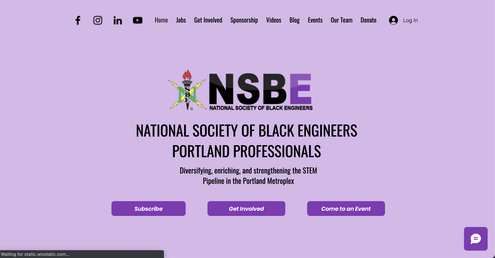
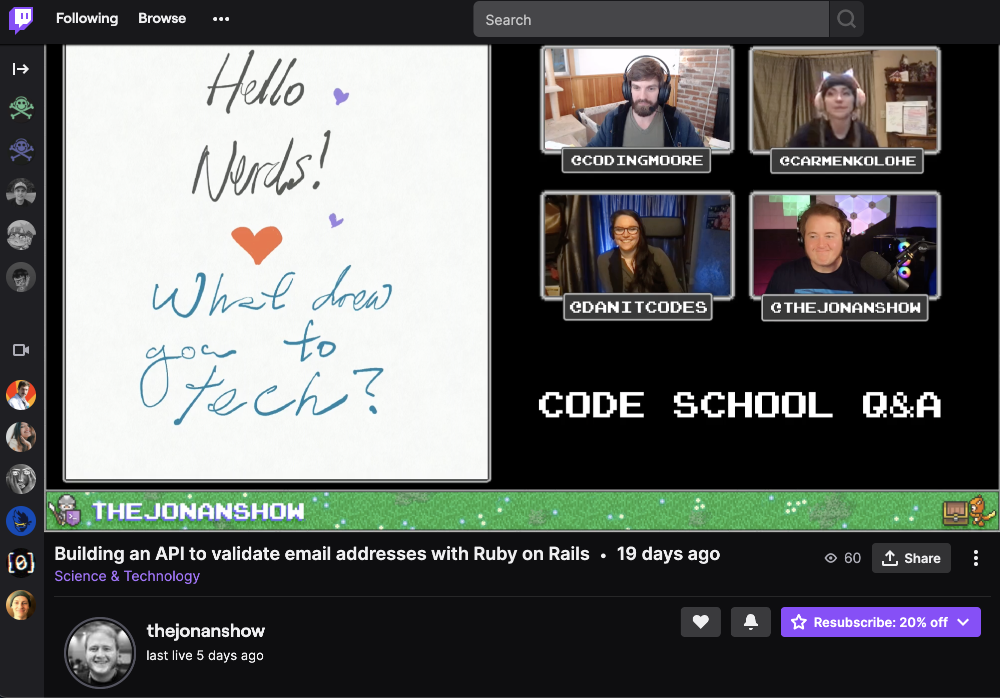

# Welcome! I'm Danielle.

 
 

Currently, I am seeking a full-stack, full-time Software Developer role. In the meantime, I am doing some independent contract work in web development, and software development at [GiftRibbn](ribbn.io). Recently, I completed a Software Development internship at the [NSBE Pro-PDX](https://www.nsbepropdx.org/) and am recent graduate of a 6-month, full-time certificate program in Web & Mobile Development at [Epicodus](www.epicodus.com) Coding School in Portland, OR.

 

 
 

|  _Coding Stats_ 	|   Site	|   Rank 	|   Points 	|   Technologies 	|
|:-:	|:-:	|:-:	|:-:	|:-:	|
|  1 	|  [CodeWars](https://www.codewars.com/users/danitcodes)  |  	|  JavaScript 	|
|  2 	|   [Edabit](https://edabit.com/user/NPPFh5vCtYrQREYaC)	  |  Level 3 	|  155XP 	|  JavaScript, C# 	|
|  3 	|   [LeetCode](https://leetcode.com/danitcodes/)	  |  N/A 	|  N/A 	|  JavaScript 	|
|  4 	|   [Exercism](https://exercism.io/profiles/danitcodes)	  |  N/A	|  N/A 	|  JavaScript, C#, Typescript 	|

 

<!-- **Incoming Stats**  
  
[Hacker Rank](https://www.hackerrank.com/danithompson74)  
  
 
  -->

## 📊 Work

### 📙 Overview

- Pronouns: **she/her, they/them**
- 🌱 I’m currently learning ... ⚡ React, Redux, Next.js, & Typescript ⚡
- 👣 Next steps for me ... securing a full-time software developer position! 🦾
- 💬 Ask me about ... craft cocktails! 🍹

### 🚧 Current & Recent Projects

- My passion project and Epicodus capstone, [Modern Potions](https://capstone-roan.vercel.app/), a craft cocktail beverage service based out of Portland.

- Redesign of and feature additions to the [NSBE Pro-PDX](https://www.nsbepropdx.org/) site.

- Front-end development for [GiftRibbn.io](ribbn.io).
- _Coming soon_ Website redesign/feature add-ons for the following local Portland businesses:
  - Portland band, Strange & the Familiars
  - FLi Social
  - Grandmere Supper Club
  - Professional portfolios & content creator sites for PDX STEM professionals.

## 📃 About Me

### 📚 Currently Reading

- Algorithms of Oppression by [Safiya Noble](http://algorithmsofoppression.com/)
- The Tangled Web: A Guide to Securing Modern Web Applications by [Michal Zalewski](https://www.oreilly.com/library/view/the-tangled-web/9781593273880/)
- Mexican Gothic by [Silvia Moreno-Garcia](https://silviamoreno-garcia.com/)

### 📚 Recently Read in 2021

- Broad Band: The Untold Story of the Women Who Made the Internet, by [Claire L. Evans](https://clairelevans.com/)
- Where the Dead Pause and the Japanese Say Goodbye by [Marie Matsuki Mockett](http://www.mariemockett.com/books/where-the-dead-pause-the-japanese-say-goodbye/)

### 👂 Podcasts on Repeat

- [Ladybug Podcast](https://www.ladybug.dev/episodes) --> ⚡ software developer gold ⚡
- [Greater Than Code](https://www.greaterthancode.com/) --> "the human side of technology"
- [Code Switch](https://www.npr.org/podcasts/510312/codeswitch) from NPR --> _not_ technical; talks on race & culture
- [My Favorite Murder](https://myfavoritemurder.com/episodes) --> 🕵 comedy meets true crime 🕵
- [Murder Squad](http://themurdersquad.com/) --> 🕵️ cold case investigator & investigative journalist team up to solve true crime 🕵️

### 🤩 Yes, that

- Documentation
- Checklists
- All the tea
- Database design
- Design systems
- Thorough testing

### 📫 Find me

- <a href=https://www.linkedin.com/in/danielle-thompson74/ >LinkedIn</a>
- <a href=https://twitter.com/danitcodes/ >Twitter</a>
- <a href=https://open.spotify.com/user/1264447945/ >Spotify</a>
- On <a href=https://www.twitch.tv/danitcodes/ >Twitch</a> weekly at 7pm ish (PST) on Wednesdays <a href=https://www.twitch.tv/thejonanshow/ >The Jonan Show</a>, on 'Code School Q&A' aimed at supporting coding school students and recent grads working to get into the tech industry.

